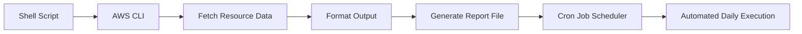
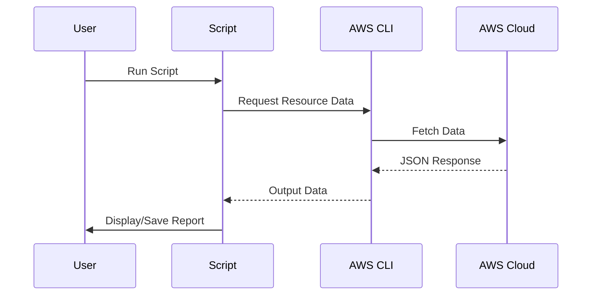

# AWS Resource Tracker using Shell Scripting
Automates AWS resource visibility to reduce cloud cost and improve governance.
---

## Project Overview

A **real-world DevOps project** that automates AWS resource tracking using **Shell Scripting + AWS CLI**, helping organizations monitor usage and optimize cloud costs.

---

## Objectives

- Track AWS resources (EC2, S3, Lambda, IAM, etc.)
- Generate readable reports
- Automate execution using **Cron Jobs**
- Improve cost visibility

---

## Why This Project?

### Cloud Benefits
- ✓ Reduced infrastructure management
- ✓ Pay-as-you-go pricing

### ⚠️ Problem
- Developers create unused resources
- AWS still charges → Increased cost

### Solution
Automate resource tracking to:
- Identify unused resources
- Optimize cloud spending

---

## Architecture



---

## Project Structure

```
Shell-Scripting-Guide/
│
03-projects/
└── 01-aws-resource-tracker/
    ├── README.md
    ├── shell-scripting-project.md
    ├── scripts/
    │   └── aws_resource_tracker.sh
    ├── outputs/
    │   └── .gitkeep
    ├── logs/
    │   └── .gitkeep
    └── utils/
        └── .gitkeep
```

## Folder Structure Explained

* `scripts/` → Contains executable shell scripts
* `outputs/` → Stores generated reports
* `logs/` → Stores execution logs
* `utils/` → Reusable helper scripts (future use)

---

## Prerequisites

### 1️. Install AWS CLI

```bash
aws --version
```

### 2️. Configure AWS

```bash
aws configure
```

Provide:

* Access Key
* Secret Key
* Region
* Output format (json)

---

## Usage

### Step 1: Clone Repo

```bash
git clone https://github.com/SachinRajguru/Shell-Scripting-Guide.git
cd Shell-Scripting-Guide/03-projects/01-aws-resource-tracker
```

### Step 2: Give Execute Permission

```bash
chmod +x scripts/aws_resource_tracker.sh
```

### Step 3: Run Script

```bash
./scripts/aws_resource_tracker.sh us-east-1 ec2
```

## Example Execution

```bash
./scripts/aws_resource_tracker.sh us-east-1 ec2
```

### Output:

```
Listing EC2 Instances in us-east-1
i-1234567890abcdef0
i-0987654321fedcba0
```

---

## Supported AWS Services

* EC2
* S3
* RDS
* Lambda
* IAM
* VPC
* CloudFront
* Route53
* CloudWatch
* CloudFormation
* SNS
* SQS
* DynamoDB
* EBS

---

## Sample Output

```bash
Listing EC2 Instances in us-east-1
i-0abcd1234efgh5678

Listing S3 Buckets
my-bucket-name
```

## ⚙️ How It Works

1. User runs the shell script
2. Script validates input (region + service)
3. AWS CLI fetches resource data
4. Output is processed (optional: `jq`)
5. Results are displayed or saved
6. Cron automates execution

---

## Output Optimization (Using jq)

```bash
aws ec2 describe-instances \
| jq '.Reservations[].Instances[].InstanceId'
```

➝ Extracts only **Instance IDs** from large JSON output

---

## Save Output to File

```bash
./aws_resource_tracker.sh us-east-1 ec2 > report.txt
```

---

## Automate with Cron Job

### Open Crontab

```bash
crontab -e
```

### Schedule Daily Execution (2 AM)

```
0 2 * * * /path/scripts/aws_resource_tracker.sh us-east-1 ec2 >> /path/report.txt
```

---

## Debug Mode

```bash
set -x
```

➝ Shows step-by-step command execution

---

## Workflow Diagram



---

## ⚠️ Best Practices

### ✓ Do’s

* Use comments in scripts
* Validate inputs
* Use `jq` for filtering
* Automate using cron
* Store logs

### ✗ Don’ts

* Don’t expose AWS credentials
* Don’t use `chmod 777` in production
* Don’t manually run scripts daily
* Don’t ignore unused resources

---

## Real-World Scenario

> Company: `example.com`

* 100+ developers
* Multiple AWS resources created
* No tracking → High cloud bill 💸

➤ This script:

* Tracks usage daily
* Generates reports
* Helps reduce cost

---

## Interview Questions

### Q1: Why use Shell Script?

**A**: Lightweight, fast, no dependencies

### Q2: What is Cron Job?

**A**: Linux scheduler for automation

### Q3: What is jq?

**A**: JSON parser for CLI output

### Q4: Why track AWS resources?

**A**: Cost optimization + governance

---

## Key Takeaways

* Cloud cost optimization is critical
* Automation saves time & money
* Shell scripting is powerful in DevOps
* AWS CLI + jq = efficient solution

---

## Future Enhancements

* ✉ Email notifications (SES / SMTP)
* 📊 Dashboard (Grafana / HTML reports)
* 🧩 Modular scripting (functions)
* ☁ Serverless execution using AWS Lambda
* 📦 Multi-service scan in single run

---
